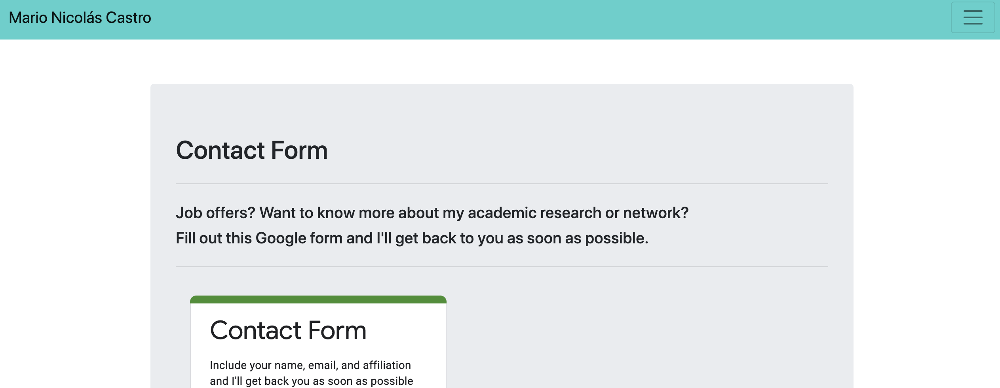

# Mario Castro's Professional Portfolio

Beta version of personal portfolio. The site currently showcases the following:

1. A short biography. 
2. A resumé. 
3. Programming and digital humanities projects. 
4. Contact section with a responsive Google Form.

* [Github repository](https://github.com/mncastro/Mario-Castro-Portfolio)
* [GithubPages](https://mncastro.github.io/Mario-Castro-Portfolio/)

## Information and general description

## UPDATES November 23, 2020

* Improved the site's overall responsiveness.
 q
* Added Footer with copyright.

* Embedded a responsive Google Form and erased old Bootstrap Input Form.

* Added links to new projects in Portfolio section.

* Navbar now has a link to download my current CV in PDF format.

* Improved HTML links and added ALT texts to all images.

* Use a grid style to place the headings and sections.

* Maintained semantic tags when possible for important sections.

* Updated README file with sampla images.

## Future Development

* Add a Publications section and implement some kind of API functionality.

## Sample Images

